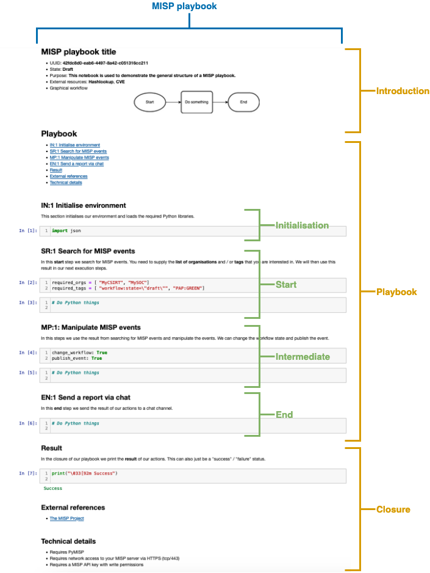

- [MISP playbooks - structure](#misp-playbooks---structure)
  - [Introduction](#introduction)
  - [Conventions and terminology](#conventions-and-terminology)
- [Format](#format)
- [Structure](#structure)
  - [Three sections](#three-sections)
  - [Introduction](#introduction-1)
  - [The steps to execute](#the-steps-to-execute)
    - [Execution steps](#execution-steps)
    - [Documentation](#documentation)
  - [Closure](#closure)
    - [Technical details](#technical-details)
  - [Overview](#overview)

# MISP playbooks - structure

## Introduction

MISP playbooks address common use-cases encountered by SOCs, CSIRTs or CTI teams to detect, react and analyse specific intelligence received by MISP.

MISP playbooks are built with Jupyter notebooks and contain
- **Documentation** in **Markdown** format, including text and graphical elements;
- **Computer code** in the **Python** programming language, primarily with the use of PyMISP.

The computer code uses PyMISP to interact with MISP but can also rely on the Python requests library. The interaction with other tools and services is via their API and the help of Python libraries such as the Timesketch, Shodan or VirusTotal Python clients. When no Python library is available the 'requests' library is used to interact with the API.

## Conventions and terminology

The key words "MUST", "MUST NOT", "REQUIRED", "SHALL", "SHALL NOT", "SHOULD", "SHOULD NOT", "RECOMMENDED", "MAY", and "OPTIONAL" in this document are to be interpreted as described in RFC 2119 [RFC2119](https://www.rfc-editor.org/rfc/rfc2119).

# Format

MISP playbooks inherit the format of Jupyter notebooks. Jupyter notebooks are simple JSON documents, containing text, source code, rich media output, and metadata. Each segment of the document is stored in a cell.

# Structure

## Three sections

Each MISP playbook must contain three sections

- Introduction 
- The steps to execute (the "core" playbook)
- Closure  

Each section is added as one or more **Jupyter notebook cells**.

## Introduction 

The introduction must be present. It exists as one or more notebook cells in **Markdown** format. In a later stage this can be transformed to a more structured (JSON) format or use the Jupyter notebook metadata section.

- *required* **Title**
- *required* **UUID**
- *optional* **Version**
- *required* **State**
- - **draft** indicates this is a rough outline of a playbook
- - **production** indicates the playbook has undergone reviews and is considered complete
- *optional* **Last update** 
- *optional* **External resources** 
- - a text block with the references to the external resources (such as 'VirusTotal', 'Shodan') required by the playbook.
- *optional* **Tags** 
- - Tags are used to classify the notebook and are provided as a list. They may use the format of MISP tags and [taxonomies](https://github.com/MISP/misp-rfc/blob/main/misp-taxonomy-format/raw.md.txt).
- *required* **Purpose**
- *optional* **Target audience**
- *optional* **Graphical workflow**
- - The graphical workflow provides a high level overview of the steps of the playbook. 
- - This workflow can for example be in [Mermaid](https://mermaid-js.github.io/mermaid/#/), the [Dot](https://github.com/laixintao/jupyter-dot-kernel) language or as an export of a [Drawio](https://app.diagrams.net/) diagram.

## The steps to execute 

The list of steps to execute for the playbook must be present. They consist of:

- *optional* An **Initialisation** step
- *required* The **Start** step
- *required* One or more **intermediate** steps
- *required* The **End** step

One playbook execution step is one or more Jupyter notebook cells.

### Execution steps

Each playbook step

- *required* Has a unique **reference number**
- *required* Is **documented** in Markdown or with graphical elements
- *required* Contains the Python code to execute the code of the playbook

### Documentation

This documentation lists 
- The input that is needed from the analysts
- - Input sections ('variables') are separated from code blocks so that analysts do
not have to change the Python code directly
- The possible risks or errors that can occur when executing the playbook
- The impact (changes to the environment) of executing this playbook
- The output, or result of the execution of the step. The output is an intermediate
status or overview of the progress of a playbook

## Closure

The last part of the playbook is the closure with
- *required* **Result** of the execution of the playbook
- *optional* **External references** for SOC analysts to gather more details
- *optional* **Technical details** for this playbook

### Technical details

The technical detail section contains an overview of the required Python libraries, the needed network flows such as firewall rules, the account setup (such as API keys) or other technical requirements to support the execution of this playbook.

## Overview

